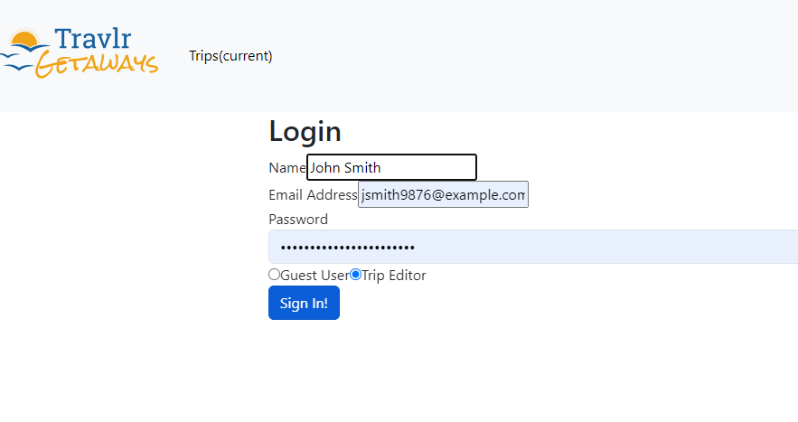
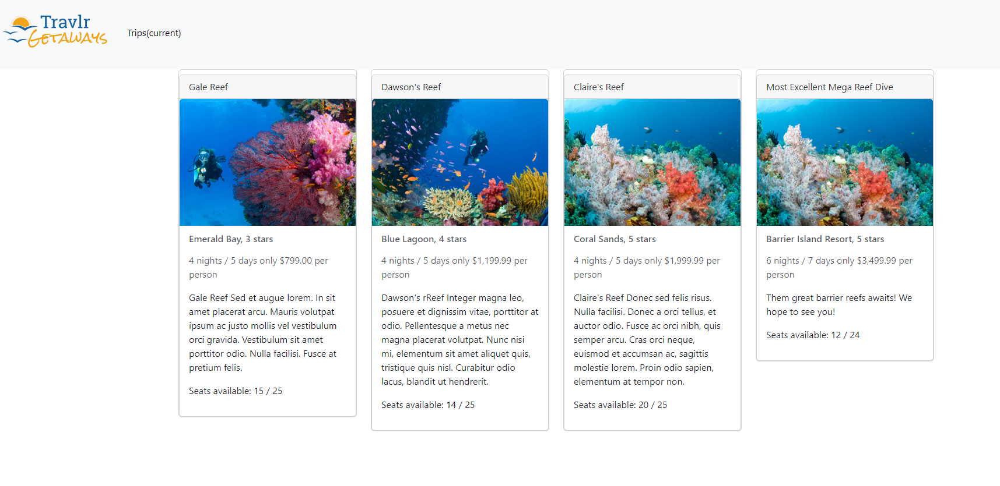
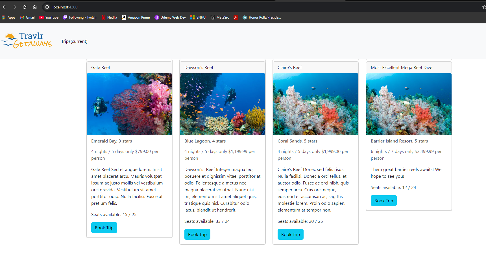
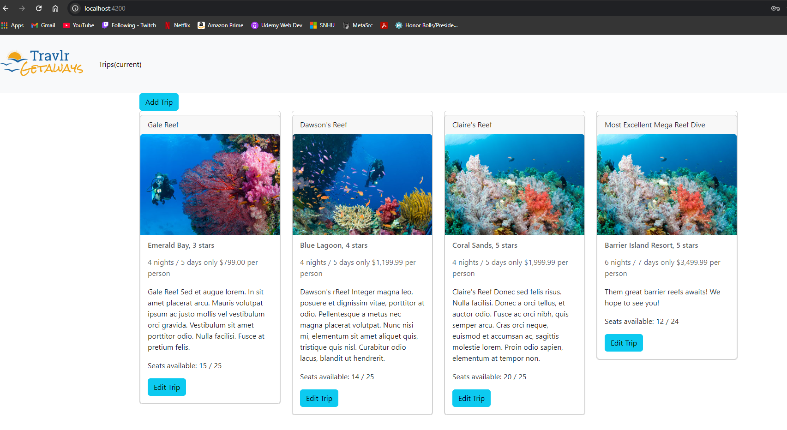
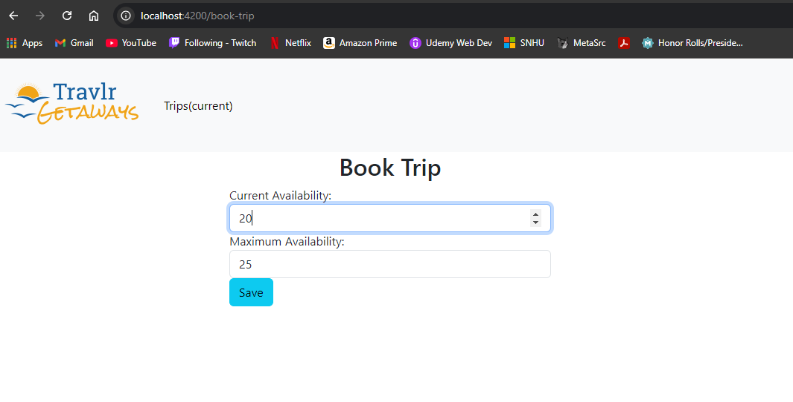
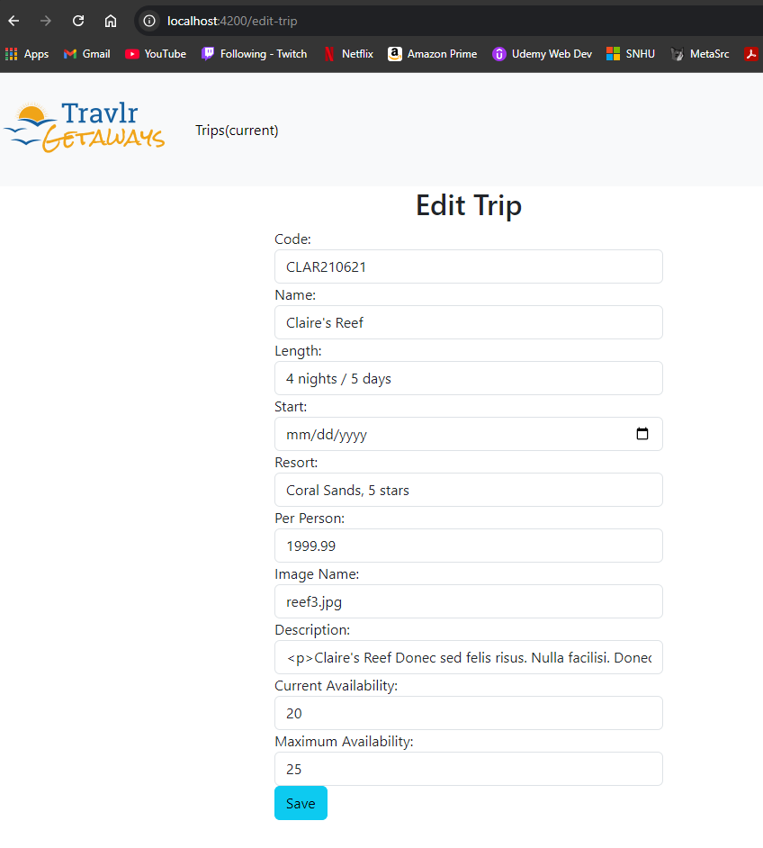
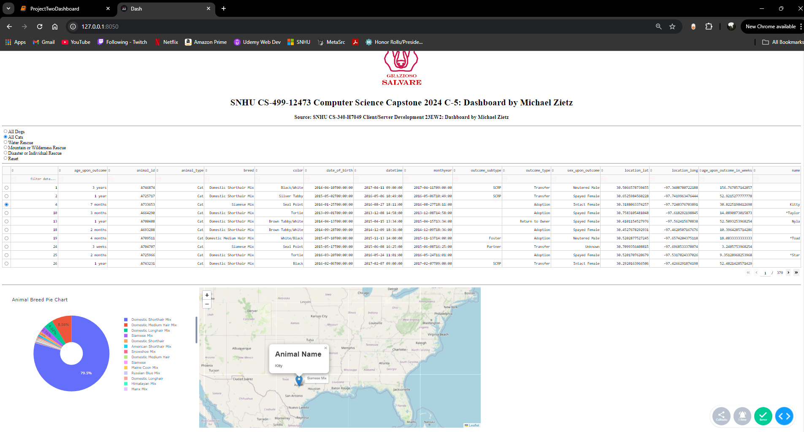
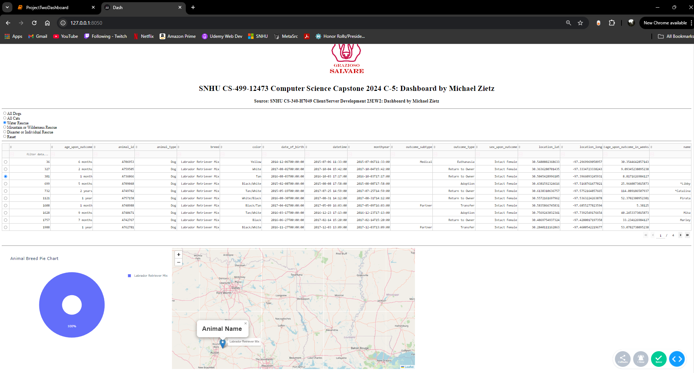
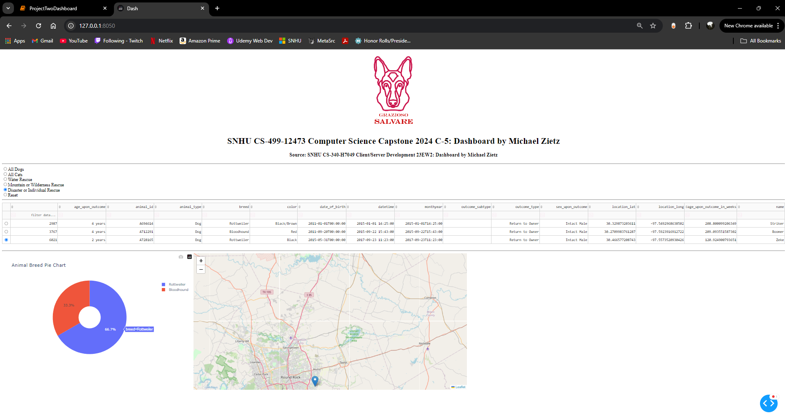
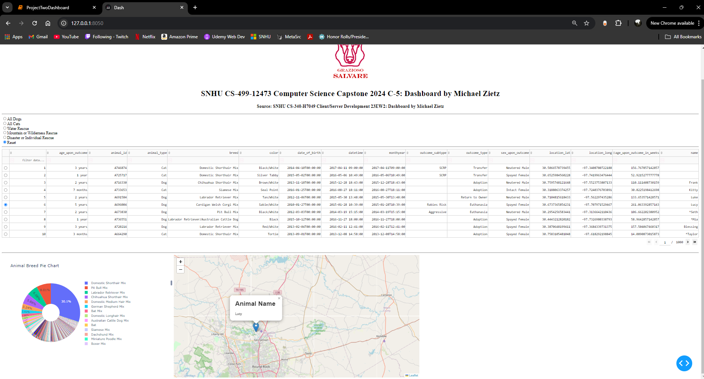

## Welcome

This ePortfolio integrates the knowledge and skills I gained and developed throughout the years of studying a Computer Science program at Southern New Hampshire University (SNHU). It represent my growth in the program and gained honor rolls from high-quality outcomes. The ePortfolio was designed and developed with a professional-quality written and a visual communication demonstrative of my capacities and abilities in a coherent, technically sound, and appropriately adapted to an specific technical audience and context.

### <u>Table of Content</u>

&nbsp;[Professional Self-Assessment](#self-assessment "Professional Self-Assessment") 
&nbsp;&nbsp;&nbsp;&nbsp;&nbsp;[_Professional SelfAssessment_](#portfolio-considerations "Portfolio Considerations") 
&nbsp;[Code Reviews](#codereview "Code Reviews") 
&nbsp;&nbsp;&nbsp;&nbsp;&nbsp;[_Code Review Videos Link_](#code-reviews "Code Reviews") 
&nbsp;[Software Design and Engineering](#softwaredesign "Software Design and Engineering") 
&nbsp;&nbsp;&nbsp;&nbsp;&nbsp;[_Artifact Software Design and Engineering_](#artifact-software-design-and-engineering "Artifact Software Design and Engineering") 
&nbsp;[Algorithms and Data Structure](#algorithms "Algorithms and Data Structure") 
&nbsp;&nbsp;&nbsp;&nbsp;&nbsp;[_Artifact Algorithms and Data Structure_](#artifact-algorithms-and-data-structures "Artifact Algorithms and Data Structure") 
&nbsp;[Databases](#databases "Databases") 
&nbsp;&nbsp;&nbsp;&nbsp;&nbsp;[_Artifact Databases_](#artifact-databases "Artifact Databases") 
&nbsp;[Self Reflection](#reflection "Self Reflection") 
&nbsp;&nbsp;&nbsp;&nbsp;&nbsp;[_Self Reflection_](#self-reflection "Self Reflection") 

### _Professional SelfAssessment_

	

In 2022, I began my studies at SNHU, but my computer science journey has been an ongoing study for over eight years. I innitially acheived my associate degree at community college while working for an IT service provider as a bench and remote technician, but after years of hands one experience with users' software issues, I desired to create programs that made their lives easier. Spanning multiple computer science fields, I have worked and learned in the pursuit of building a well rounded skill-set. I joined SNHU's program to improve my programming and application development understanding as well as sneak a glimps at what a career in software development life cycle (SDLC) might look like. This effort was derrived from of my passion for working with computers and technology, creating functional and creative user experiences, and experience working in IT as a technician.

While in the SNHU's computer science program, I have learned and improved my abilities, skills, and knowledge as a Full-Stack developer. I've honed my attention to detail and security essential skills for my role as a software engineer and developer. By staying organized and methodical in my code development, breaking tasks into manageable chunks, and integrating testing into my workflow, I've refined these abilities. Testing is vital for ensuring that a program functions properly and is free from weaknesses and vulnerabilities, which becomes increasingly challenging as projects grow more complex. Embracing both a tester mindset and a security-focused approach are crucial skills that continuously evolve and improve.

| **Hard Skills** | **Soft Skills** |
|:-----------:|:-----------:|
| Full Stack Development | Detail Orientation |
| Reverse Engineering | Organization |
| Data Structures and Algorithms | Problem Solvingg |
| Client/Server Development | Communication |
| Mobile Development | Teamwork |
| Secure Coding | Troubleshooting |
| C++ | Testing |
| Java | Documentation |
| Python | IT Experience |

Southern New Hampshire University's program enhanced my ability to swiftly acquire new skills, and it fostered my ability to solve problems with intellectual humility and leadership qualities. These hard skills—spanning computer and technology expertise, data analysis, software development, and technical writing—are showcased through the work presented in this ePortfolio. Together, they position me as a strong candidate for a software engineering role, emphasizing the development of algorithms that are comprehensible to both computers and, more importantly, humans.

For a more indepth narrative for self-assessment, please visit 

	
<em>Through this ePortfolio's display of artifact enhancements, I seek to showcase that I have successfully acheived the following course outcomes:</em>

1. Employ strategies for building collaborative environments that enable diverse audiences to support organizational decision-making in the field of computer science.  
2. Design, develop, and deliver professional-quality oral, written, and visual communications that are coherent, technically sound, and appropriately adapted to specific audiences and contexts.  
3. Design and evaluate computing solutions that solve a given problem using algorithmic principles and computer science practices and standards appropriate to its solution while managing the trade-offs involved in design choices.  
4. Develop a security mindset that anticipates adversarial exploits in software architecture and designs to expose potential vulnerabilities, mitigate design flaws, and ensure privacy and enhanced security of data and resources.  
5. Demonstrate an ability to use well-founded and innovative techniques, skills, and tools in computing practices for the purpose of implementing computer solutions that deliver value and accomplish industry-specific goals.

    <a href="#">
        <button style="font-size: 10px; font-weight: 500; background: #4169e1; color: #ffffff; border-radius: 50px; border-style: solid; border-color: #4169e1; padding: 5px 5px;">Back to Beginning &#8593;</button>
    </a>

### _Code Review Videos Link_

	

In the following code review video, I walk through the existing artifact's code base, showcasing its current capabilities, flaws, and areas for desired enhancements. 

    

        <iframe width="560" height="315" src="https://www.youtube.com/embed/v2_f27b3nc0?si=LTfEh_0_WdcmKXrY" title="YouTube video player" frameborder="0" allow="accelerometer; autoplay; clipboard-write; encrypted-media; gyroscope; picture-in-picture; web-share" referrerpolicy="strict-origin-when-cross-origin" allowfullscreen></iframe>
    

    
<em>Figure 1 - Software Design and Engineering Code Review Video</em>

I have selected a previous project I created in Python independent of my courses at SNHU to enhance. This artifact served as my first dive into studying Python before returning to higher education and completing my bachelor’s in computer science. The project spans three files with a main class and two subclasses. The current work can replicate a simplified version of classic table-top gaming combat within a Python-based terminal. It records user input to create one or more characters and weapons with unique properties and simulates the combination of character and weapon damage during their turn using rule systems inspired by Pathfinder by Paizo.

In the following code review video, I walk through the existing artifact's code base, showcasing its current capabilities, flaws, and areas for desired enhancements. 

    <iframe width="560" height="315" src="https://www.youtube.com/embed/YXH35-RTd6A?si=Vw3eXmYK7szwsBeo" title="YouTube video player" frameborder="0" allow="accelerometer; autoplay; clipboard-write; encrypted-media; gyroscope; picture-in-picture; web-share" referrerpolicy="strict-origin-when-cross-origin" allowfullscreen></iframe>
    

    
<em>Figure 2 - Algorithms and Data Structure Code Review Video</em>

This artifact creates a web-based application, named Travlr Getaways, that creates a platform where vacation trips are packaged and published for travel agents to add and modify. It was created for a previous course at SNHU, CS 465 Full Stack Development, and its original state was the final submission for the class. It utilizes the MEAN stack, which includes MongoDB, Express JavaScript, Angular JavaScript, and Node JavaScript. Angular serves as the client-side framework written in JS, while Express is used as the framework for the backend, and MongoDB functions as the database. Node, also written in JavaScript, acts as the primary web server framework. In its current state, Travlr’s web application is capable of hosting these travel pack ages, allowing non existing users to view trip details, but requiring authenticated sign in to edit existing or create new trip packages.

In the following code review video, I walk through the existing artifact's code base, showcasing its current capabilities, flaws, and areas for desired enhancements.  

    

        <iframe width="560" height="315" src="https://www.youtube.com/embed/YQ8RZSyzdP4?si=BygrfLwUUi3skcJR" title="YouTube video player" frameborder="0" allow="accelerometer; autoplay; clipboard-write; encrypted-media; gyroscope; picture-in-picture; web-share" referrerpolicy="strict-origin-when-cross-origin" allowfullscreen></iframe>
    

    
<em>Figure 3 - Databases Code Review Video</em>

This artifact was developed for a previous course, CS-340 Client/Server Development, at SNHU. The client, Grazioso Salvare, needed to interact with their existing data from animal shelters. This artifact intended to identify and categorize animals which have been entered into the system based on their criteria. Grazioso Salvare needed to use this software to identify animal profiles to train for various tasks, and they have requested this project be open source and accessible on GitHub to aid other, similar organizations. Rather than manually sorting through each database, which can take tedious and time-consuming effort, this software will reduce this human waste by requiring simple inputs to retrieve data from databases quickly. It will be able to create new entries, read/search for existing ones, update entries, and delete them as well.

    <a href="#">
        <button style="font-size: 10px; font-weight: 500; background: #4169e1; color: #ffffff; border-radius: 50px; border-style: solid; border-color: #4169e1; padding: 5px 5px;">Back to Beginning &#8593;</button>
    </a>

### _Artifact Software Design and Engineering_

	

I have recreated this Python project as a Java mobile app using Android Studio to improve the artifact’s base functionality through implementing new features, correcting known issues, and improving both the error handling and comments. New feature additions include opponents, with their own sets of properties, for the characters to simulate combat, and a rounds system to challenge the user’s character with procedurally more difficult enemies to face. Between each round, the user will have the option to fight or flee, and once the user is defeated in combat or flees their first time the simulation ends, showing a collection of statistics their character was able to achieve. The final improvement I seek to add is creating a permanent record outside the application’s run instance that saves the user’s highest recorded attempts. 

Artifact ORIGINAL files repository at [Original Software Design and Engineering](https://github.com/MichaelZietz/MichaelZietz.github.io/tree/main/Original/Software%20Engineering%20and%20Design)

Artifact ENHANCEMENT files repository at [Enhancement Software Design and Engineering](https://github.com/MichaelZietz/MichaelZietz.github.io/tree/main/Enhancements/Software%20Engineering%20and%20Design)
For an in-depth review of the enhancements made to the original artifact visit [Software Design and Engineering Documentation]()

    <a href="#">
        <button style="font-size: 10px; font-weight: 500; background: #4169e1; color: #ffffff; border-radius: 50px; border-style: solid; border-color: #4169e1; padding: 5px 5px;">Back to Beginning &#8593;</button>
    </a>

### _Artifact Algorithms and Data Structures_

	

This artifact was selected with the intention to correct known functionality issues in addition to new features that create purpose for new users outside of the current one designed for a trip agent. I sought to improve the clarity and structure of the project as well as correcting some lingering issues left after its original submission. Due to deprecated use of login authorization in the project’s final version, this left an issue with users not being able to submit POST commands to create new or edit existing trip objects after signing in. I seek to implement current tools and APIs used to perform this authentication and enable full functionality to the website developed. I also would like to revisit other pages from the website and implement SQL functionality to other areas other than trip ID management. I plan to implement booking reservations and reconciling availabilities. In its current state, the website is only able to take advantage of a small portion of its promised features and does not separate different types of users signing in. I seek to introduce user roles, those intended to edit trip and those intended to book them, and allow functionality related to them. The website will also need to have features implemented to allow booking once all conditions allow it.

Artifact ORIGINAL files repository at [Original Algorithms and Data Structures](https://github.com/MichaelZietz/Full-Stack-Development/tree/module7)

    
    
<em>Figure X - Travlr Getaways Login Screenshot</em>

    
    
<em>Figure X - Travlr Getaways Full Stack Logged Out</em>

    
    
<em>Figure X - Travlr Getaways Full Stack Guest Home Screen.png</em>

    
    
<em>Figure X - Travlr Getaways Full Stack Admin Home Screen</em>

    
    
<em>Figure X - Travlr Getaways Full Stack Book Trip Screen</em>

    
    
<em>Figure X - Travlr Getaways Full Stack Edit Trip Screen</em>

Artifact ENHANCEMENT files repository at [Enhancement Algorithms and Data Structures](https://github.com/MichaelZietz/Full-Stack-Development/tree/enhancement)
For an in-depth review of the enhancements made to the original artifact visit [Algorithms and Data Structures Documentation]()

    <a href="#">
        <button style="font-size: 10px; font-weight: 500; background: #4169e1; color: #ffffff; border-radius: 50px; border-style: solid; border-color: #4169e1; padding: 5px 5px;">Back to Beginning &#8593;</button>
    </a>

### _Artifact Databases_

	

I have selected this artifact to enhance because the successful recreation of this application initially designed for Linux OS demonstrates my understanding of the Python language as well as Dash, skills deploying MongoDB and CRUD functionality, and ability to reproduce and recreate scripts inside Jupyter Notebook. I sought to enhance this application’s current GUI, as its pie chart often results in unappealing visuals that clutter the screen, migrate the project, as it was initially created for a virtual Linux-based lab environment, named Apporto, and recreate it in a Windows OS environment. This required me to install and coordinate compatible versions of Python and MongoDB. For this application, the PyMongo library is need to be utilized in order to successfully connect Dash’s capabilities with MongoDB. The recreated application must include authentication before allowing access to CRUD features as only specified individuals should be granted permissions to modify stored data. 

Artifact ORIGINAL files repository at [Original Databases](https://github.com/MichaelZietz/MichaelZietz.github.io/tree/main/Original/Databases)

    
    
<em>Figure X - Grazioso Salvare Search Web App Client/Database Dashboard All Cats</em>

    
    
<em>Figure X - Grazioso Salvare Search Web App Client/Database Dashboard Water Rescue</em>

    
    
<em>Figure X - Grazioso Salvare Search Web App Client/Database Dashboard Disaster Rescue</em>

    
    
<em>Figure X - Grazioso Salvare Search Web App Client/Database Dashboard Reset</em>

Artifact ENHANCEMENT files repository at [Enhancement Databases](https://github.com/MichaelZietz/MichaelZietz.github.io/tree/main/Enhancments/Databases)
For an in-depth review of the enhancements made to the original artifact visit [Databases Documentation](https://github.com/MichaelZietz/MichaelZietz.github.io/blob/0ba0cd5ccf0d79db0638cce3ddbbe808cfb6d9bd/Documents/Zietz_Michael_5-2%20Milestone%20Four%20Enhancement%20Three%20Databases.docx)

    <a href="#">
        <button style="font-size: 10px; font-weight: 500; background: #4169e1; color: #ffffff; border-radius: 50px; border-style: solid; border-color: #4169e1; padding: 5px 5px;">Back to Beginning &#8593;</button>
    </a>

### _Self Reflection_

	

[Journal: What Makes a Productive Code Review?](https://github.com/MichaelZietz/MichaelZietz.github.io/blob/0ba0cd5ccf0d79db0638cce3ddbbe808cfb6d9bd/Documents/Zietz_Michael_2-1%20Journal.docx)
This paper discusses what makes a productive code review and how to successfully critique, record, and discuss enhancements for the code base being studied. 

[Journal: Marketing With ePortfolios and Artifact Update](https://github.com/MichaelZietz/MichaelZietz.github.io/blob/0ba0cd5ccf0d79db0638cce3ddbbe808cfb6d9bd/Documents/Zietz_Michael_3-1%20Journal.docx)
This paper reflects on how this ePortfolio might impact my career options and make me stand out as a candidate for employers. 

[Journal: Career Choice and Artifact Update](https://github.com/MichaelZietz/MichaelZietz.github.io/blob/0ba0cd5ccf0d79db0638cce3ddbbe808cfb6d9bd/Documents/Zietz_Michael_4-1%20Journal.docx)
This paper is a course submission reflection of how my career journey has been impacted by my studies at SNHU in pursuit of my bachelor's in computer science with a concentration in software engineering. 

[Journal: Computer Science Trends and Artifact Update](https://github.com/MichaelZietz/MichaelZietz.github.io/blob/0ba0cd5ccf0d79db0638cce3ddbbe808cfb6d9bd/Documents/Zietz_Michael_5-1%20Journal.docx)
This paper delves into a research discussion on new computer science trends that I've noticed in the field. It reviews the emerging popular use of concepts like "Zero Trust" policy making and large language artificial intelligence models like ChatGPT. I look at how these trends affect not just the developers utilizing them but also the affected trends for users and the field of study. 

[Journal: Emerging Technology and Artifact Update](https://github.com/MichaelZietz/MichaelZietz.github.io/blob/0ba0cd5ccf0d79db0638cce3ddbbe808cfb6d9bd/Documents/Zietz_Michael_6-1%20Journal.docx)
This paper takes a look at emerging technologies in computer science. I specifically research and discuss API resources like OpenAI and Slant3D's 3D printing API, how they can impact my career, the computer science field, and their communities. 

    <a href="#">
        <button style="font-size: 10px; font-weight: 500; background: #4169e1; color: #ffffff; border-radius: 50px; border-style: solid; border-color: #4169e1; padding: 5px 5px;">Back to Beginning &#8593;</button>
    </a>

